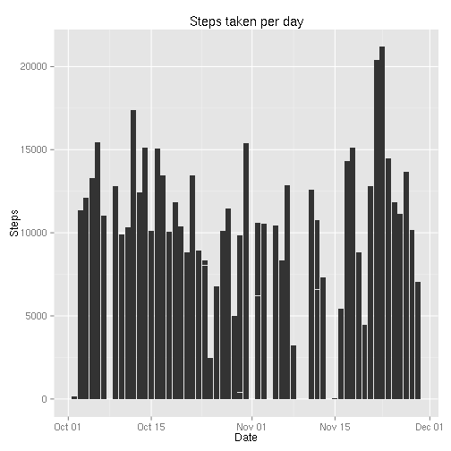
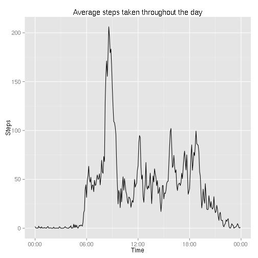
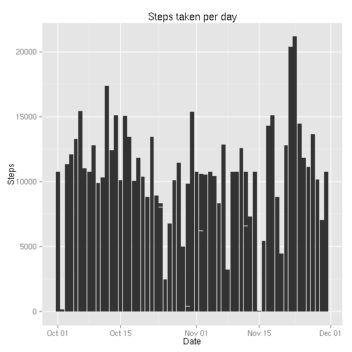
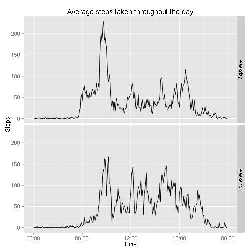

# Reproducible Research: Peer Assessment 1


## Loading and preprocessing the data

Read in the data from a csv format while turning the `date` column into date
elements, also creating a data set ignoring and NA data:

```r
df <- read.csv('activity.csv')
df$date <- as.Date(df$date, format = "%Y-%m-%d")

df_na <- na.omit(df)
```

## What is mean total number of steps taken per day?

First, we make a histogram of the steps, ordered by date:

```r
ggplot(df_na, aes(x = date, y = steps)) +
    geom_histogram(stat = "identity") +
    labs(title = "Steps taken per day", x = "Date", y = "Steps")
```

 


```r
agg_date <- aggregate(df_na$steps, list(date = df_na$date), sum)

mean_steps <- mean(agg_date$x)
median_steps <- median(agg_date$x)
```
We compute the mean number of steps per day to be
10766.2 and the median number of steps per day to be
10765.

## What is the average daily activity pattern?

First, we need to compute and plot the average number of steps per 5 min
interval across all the days:

```r
agg_interval <- aggregate(df_na$steps, list(interval = df_na$interval), mean)
# The times are done as `HHMM`, lets make a string like that and format it as a time
agg_interval$time <- strptime(sprintf("%04d", agg_interval$interval), format="%H%M")

ggplot(agg_interval, aes(x = time, y = x)) +
    scale_x_datetime(labels = date_format("%H:%M")) +
    geom_line() +
    labs(title = "Average steps taken throughout the day", x = "Time", y = "Steps")
```

 


```r
max_interval_steps <- max(agg_interval$x)
max_interval <- agg_interval$time[which.max(agg_interval$x)]
```
We see the 5 min interval with the most steps taken on average is
08:35, with
206.2 steps.

## Imputing missing values


```r
n_missing <- nrow(df) - nrow(df_na)
```
Looking at the data file, we will see there are many days and intervals with
missing data. We are missing a total of 2304 data points.

In order to get a bit better sense of our data as a function of date, we will
use the *mean number of steps in that interval* to impute the data points that
are missing.

```r
df_imp <- data.frame(df)

# loop over the indices of the NA data
for (i in which(is.na(df_imp$steps))) {
    # determine the item in the aggregate data corresponding to this interval
    interval_index <- match(df_imp$interval[i], agg_interval$interval)

    # impute the data
    df_imp$steps[i] <- agg_interval$x[interval_index]
}
```

We can plot the histogram of this new data set, similar to the first histogram,
but with the imputed data for the missing days:

```r
ggplot(df_imp, aes(x = date, y = steps)) +
    geom_histogram(stat = "identity") +
    labs(title = "Steps taken per day", x = "Date", y = "Steps")
```

 

On the imputed data set, we

```r
agg_date_imp <- aggregate(df_imp$steps, list(date = df_imp$date), sum)

mean_steps_imp <- mean(agg_date_imp$x)
median_steps_imp <- median(agg_date_imp$x)
```
On the imputed data set, we compute the mean number of steps per day to be
10766.2 and the median number of steps per day to
be 10766.2.

Note that the mean doesn't change (!!!), and the median goes to the mean value
(the median from before isn't preserved because we have used the mean, which
gives floating point numbers, to impute).

## Are there differences in activity patterns between weekdays and weekends?

We can compare the differences between the weekdays and the weekends on the
average steps taken on any given time interval.  First we create a factor to
split the data into weekdays and weekends:

```r
days <- mapvalues(weekdays(df_imp$date, abbreviate=TRUE),
                  c("Mon", "Tue", "Wed", "Thu", "Fri", "Sat", "Sun"),
                  c(rep("weekday", 5), rep("weekend", 2)))
df_imp$weekday <- factor(days)
```

Now we can go and plot the data for both the weekend and the weekdays:

```r
agg_interval_weekday <- aggregate(df_imp$steps, list(interval = df_imp$interval, weekday = df_imp$weekday), mean)
# The times are done as `HHMM`, lets make a string like that and format it as a time
agg_interval_weekday$time <- strptime(sprintf("%04d", agg_interval_weekday$interval), format="%H%M")

ggplot(agg_interval_weekday, aes(x = time, y = x)) +
    facet_grid(weekday ~ .) +
    scale_x_datetime(labels = date_format("%H:%M")) +
    geom_line() +
    labs(title = "Average steps taken throughout the day", x = "Time", y = "Steps")
```

 
